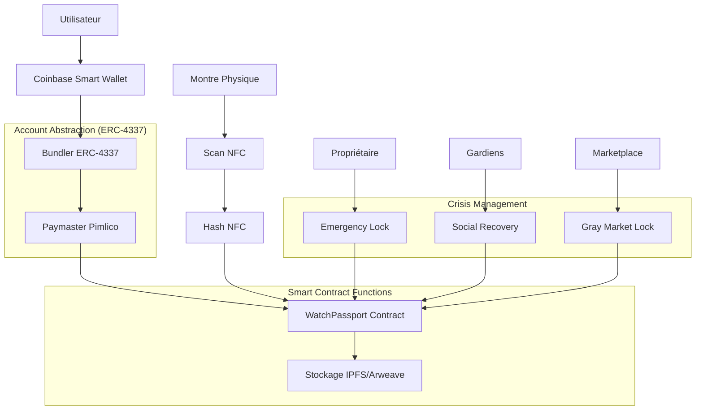
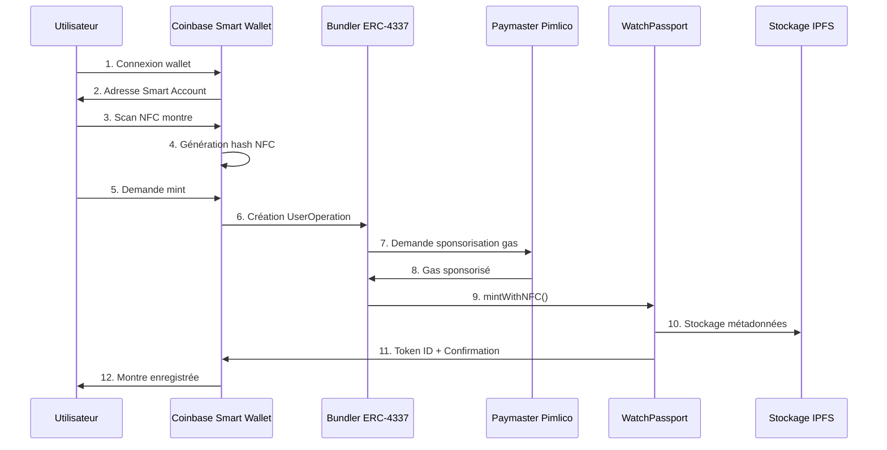
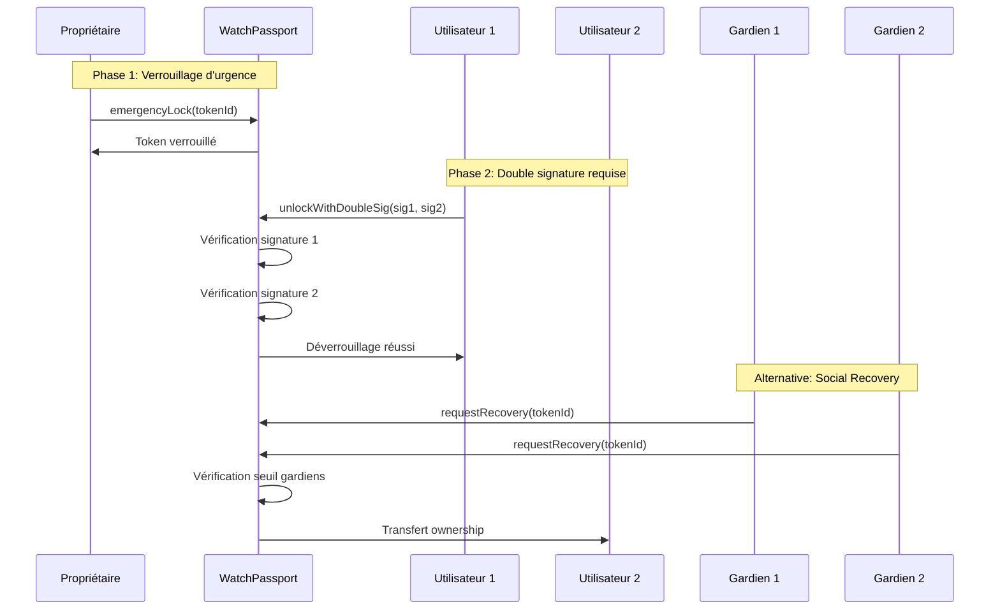
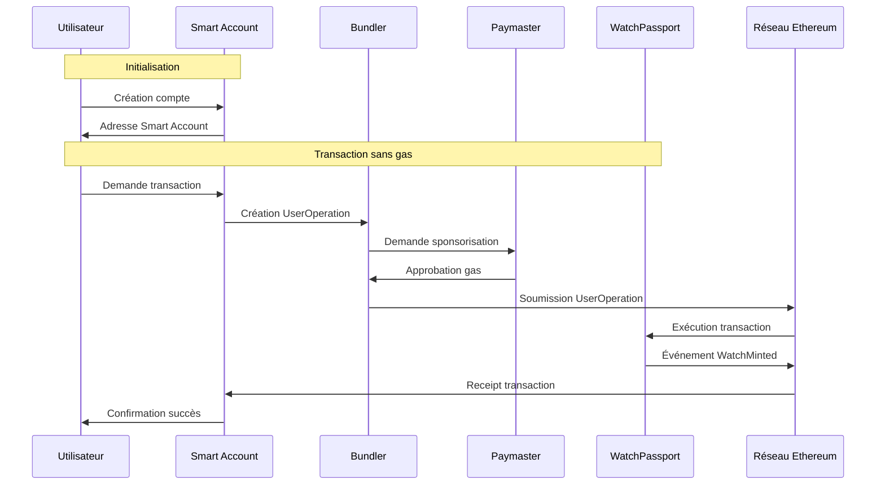
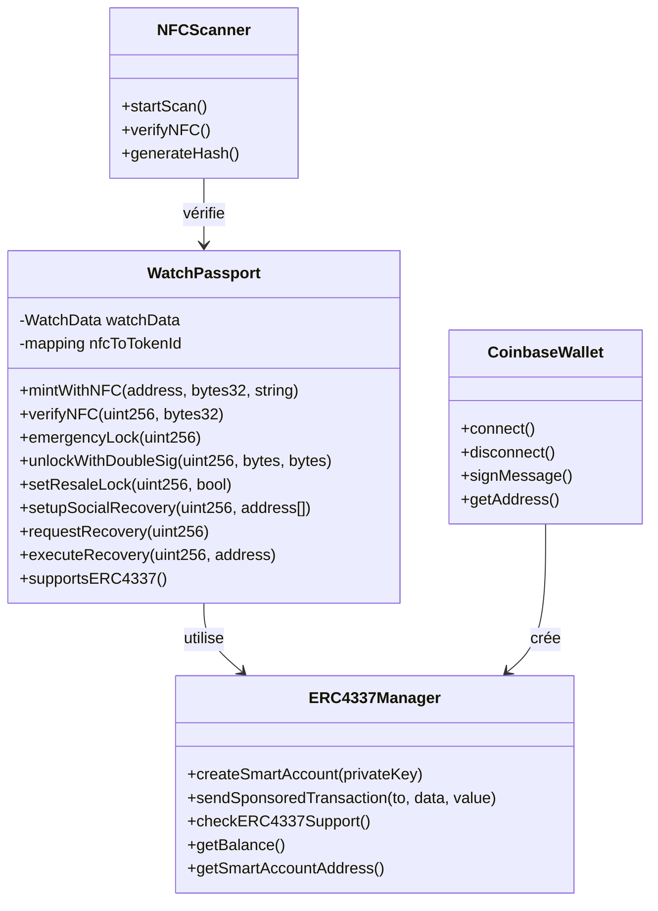
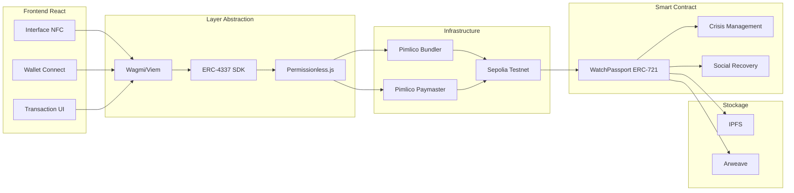

# Watch Whispers - Schémas UML

## Diagramme de Flux Global

## Diagramme de Séquence - Mint NFC

## Diagramme de Séquence - Emergency Lock

## Diagramme de Séquence - ERC-4337 Flow Complet

## Diagramme de Classes - Architecture

## Flux de Données - Architecture Complète

## Spécifications Techniques

### Account Abstraction (ERC-4337)
- **Bundler**: Pimlico (https://api.pimlico.io)
- **Paymaster**: Sponsorisation du gas automatique
- **Smart Account**: Compte abstrait sans seed phrase
- **User Operation**: Transaction groupée optimisée

### Sécurité Cryptographique
- **Double Signature**: Vérification ECDSA EIP-712
- **Message Hash**: keccak256(abi.encodePacked(tokenId, owner))
- **Recovery**: Multi-signature gardiens (seuil = 2)

### Flux Crisis Cards
1. **NFC Cloné**: Emergency lock + double signature
2. **Gray Market**: Resale lock 365 jours
3. **Social Recovery**: Guardian multi-sig recovery

### Intégrations Externes
- **IPFS**: Métadonnées des montres
- **Arweave**: Stockage permanent
- **Coinbase**: Smart Wallet uniquement
- **Sepolia**: Testnet Ethereum
